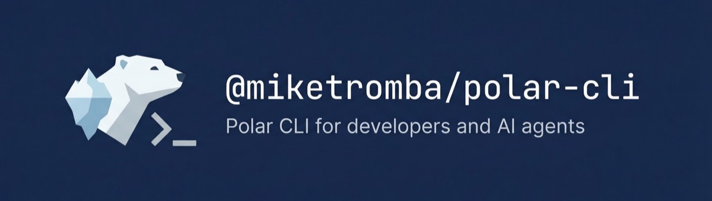

<p align="center">
  
</p>

<p align="center">
  Unofficial CLI for the <a href="https://polar.sh">Polar</a> platform. Full API parity with the <a href="https://github.com/polarsource/polar-js">@polar-sh/sdk</a>, optimized for developers and AI agents.
</p>

## Getting Started

Install the CLI, then give your AI assistant the skill to use it:

```shell
npm install -g @miketromba/polar-cli
npx skills add miketromba/polar-cli
```

That's it. Your AI assistant now knows how to manage your Polar products, customers, subscriptions, checkouts, and more — just ask it naturally.

### Other package managers

```bash
# yarn
yarn global add @miketromba/polar-cli

# pnpm
pnpm add -g @miketromba/polar-cli

# bun
bun install -g @miketromba/polar-cli

# or run without installing
npx @miketromba/polar-cli products list
```

Works with Node.js 18+.

## Quick Start

```bash
# Authenticate
polar auth login --token polar_pat_...

# List your products
polar products list

# Get a specific customer
polar customers get cust_abc123

# Count active subscriptions
polar subscriptions list --active -o count

# Create a checkout
polar checkouts create --products prod_123 --success-url https://example.com/thanks
```

## AI-Agent Optimized Output

The CLI auto-detects whether it's being piped and adjusts output accordingly:

- **TTY (interactive)** — table format with colors
- **Piped / non-TTY** — compact `key=value` format, minimal tokens

```bash
# Human sees a table
polar products list

# AI agent (piped) sees compact output
polar products list | cat
# products 1-5/42 page=1
#   [1] id=prod_123 name="Pro Plan" isRecurring=true prices=1
#   [2] id=prod_456 name="Starter" isRecurring=true prices=1
# next: polar products list --page 2 --limit 5
```

### Output Formats

| Flag | Format | Best For |
|------|--------|----------|
| `-o compact` | `key=value` one-liners | AI agents (default when piped) |
| `-o table` | Aligned columns | Humans (default in terminal) |
| `-o json` | Minified JSON | Programmatic consumption |
| `-o jsonl` | JSON Lines | Streaming / `jq` |
| `-o csv` | CSV with headers | Export / spreadsheets |
| `-o tsv` | Tab-separated | Unix tools (`cut`, `awk`) |
| `-o id` | IDs only, one per line | Piping to other commands |
| `-o count` | Single integer | "How many?" queries |

### Field Selection

```bash
# Only show specific fields
polar customers list --fields id,email,name

# Full detail on a single entity
polar products get prod_123 --detail
```

## Commands

### Core

| Command | Description |
|---------|-------------|
| `polar products` | Manage products (list, create, update, archive) |
| `polar subscriptions` | Manage subscriptions (list, get, create, revoke) |
| `polar orders` | Manage orders (list, get, invoices, export) |
| `polar customers` | Manage customers (list, create, update, delete) |
| `polar checkouts` | Manage checkout sessions |
| `polar checkout-links` | Manage reusable checkout links |

### Monetization

| Command | Description |
|---------|-------------|
| `polar benefits` | Manage benefits (custom, Discord, GitHub, downloads, license keys) |
| `polar benefit-grants` | View benefit grant history |
| `polar license-keys` | Manage and validate license keys |
| `polar discounts` | Manage discount codes and promotions |
| `polar refunds` | Manage refunds |
| `polar disputes` | View payment disputes |
| `polar payments` | View payment history |

### Usage-Based Billing

| Command | Description |
|---------|-------------|
| `polar meters` | Manage usage meters |
| `polar customer-meters` | View customer meter usage |
| `polar events` | Manage and ingest custom events |
| `polar event-types` | Manage event type definitions |
| `polar metrics` | Query analytics metrics |

### Organization

| Command | Description |
|---------|-------------|
| `polar orgs` | Manage organizations |
| `polar members` | Manage organization members |
| `polar org-tokens` | Manage organization access tokens |
| `polar webhooks` | Manage webhook endpoints and deliveries |
| `polar custom-fields` | Manage custom checkout/order fields |
| `polar files` | Manage file uploads |

### Identity

| Command | Description |
|---------|-------------|
| `polar oauth2` | OAuth2 authorization and token management |
| `polar oauth2-clients` | Manage OAuth2 clients |
| `polar customer-sessions` | Create customer portal sessions |
| `polar member-sessions` | Create member sessions |
| `polar customer-seats` | Manage subscription seats |

### Customer Portal

All under `polar portal`:

```bash
polar portal subscriptions list
polar portal orders get ord_123
polar portal license-keys validate --key LK-...
polar portal benefit-grants list
polar portal wallets list
# ...and more
```

## Configuration

```bash
# Set default organization
polar config set organizationId org_abc123

# Use sandbox environment
polar config set server sandbox

# View all config
polar config list
```

### Environment Variables

| Variable | Purpose |
|----------|---------|
| `POLAR_ACCESS_TOKEN` | Access token (overrides stored credential) |
| `POLAR_ORGANIZATION_ID` | Default organization ID |
| `POLAR_SERVER` | `production` or `sandbox` |
| `POLAR_OUTPUT` | Default output format |

## Global Flags

| Flag | Short | Description |
|------|-------|-------------|
| `--output <format>` | `-o` | Output format |
| `--fields <list>` | `-f` | Comma-separated field selection |
| `--detail` | `-d` | Full detail view |
| `--server <name>` | `-s` | Server: production or sandbox |
| `--org <id>` | | Organization ID override |
| `--yes` | `-y` | Skip confirmation prompts |
| `--quiet` | `-q` | Data only, no hints |
| `--limit <n>` | `-l` | Items per page (list commands) |
| `--page <n>` | `-p` | Page number (list commands) |
| `--first <n>` | | Shorthand for `--limit N --page 1` |

## Development

Requires [Bun](https://bun.sh) for development (end users only need Node.js 18+).

```bash
# Install dependencies
bun install

# Run the CLI locally (via Bun, no build step)
bun run polar -- products list

# Run tests (200 tests, ~3s)
bun test

# Run tests in watch mode
bun test --watch

# Lint
bun run lint

# Type check
bun run typecheck

# Build for distribution (outputs dist/polar.js)
bun run build
```

## License

MIT
